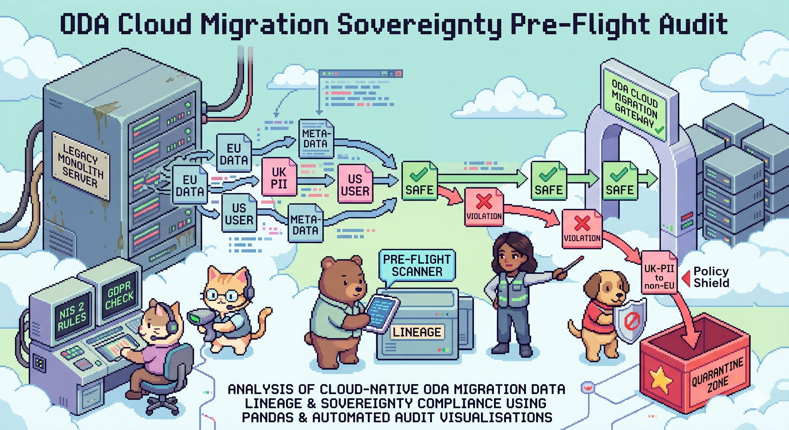

# ☁️✨ ODA Cloud Migration: Data Sovereignty Pre-Flight Audit



**Author:** Aarti Santoshkumar Omane 🌸  
**Role:** Data Scientist & Analyst 

### 📌 1. Background and Overview

In the highly regulated telecommunications landscape, migrating from legacy hardware (monoliths) to a decoupled "Telco-as-a-Service" cloud model is a massive undertaking. This project focuses on Vodafone's transition to the **Open Digital Architecture (ODA)** framework. 

During this migration, data must flow from old servers to new cloud nodes. The critical bottleneck is **Data Sovereignty**. If European or UK customer data routes to an unauthorised non-EU server, it breaks GDPR and NIS 2 compliance laws. 

The goal of this project is to engineer an automated "Digital Bouncer"—a pre-flight audit tool that programmatically monitors simulated legacy-to-cloud data pipelines to identify, intercept, and quarantine cross-border compliance violations before they hit production.

---

### 📊 2. Data Structure & Initial Checks

The analysis and simulation were conducted by generating a dataset of 100 simulated telecom network data packets with the following key attributes:
* **Payload Type:** Categorized into highly restricted `Customer_PII` and flexible `System_Metadata`.
* **Source & Destination:** The geographical routing vectors (e.g., `Legacy_UK_Node` to `Cloud_EU_Node`).
* **Compliance Status:** A boolean flag determining if the routing vector violates regional data laws.

**Initial Quality Checks:**
* Engineered a Python-based logic engine (`digital_bouncer.py`) to generate and validate the data simultaneously.
* Ensured zero null values in the routing vectors.
* Formatted the output into a clean CSV for seamless ingestion into enterprise Business Intelligence tools.

---

### 🚀 3. Executive Summary

The pre-flight audit successfully demonstrated how automated data governance can mitigate multi-million-pound regulatory risks:
* **Automated Interception:** The Python engine successfully acted as a digital bouncer, scanning packet metadata and automatically quarantining unauthorised transfers.
* **Visibility:** By connecting the audit log to interactive dashboards, Cloud Migration Managers can now visually track exactly where compliance bottlenecks are happening in real-time.
* **Proof of Concept:** The simulation proves that cross-border Data Sovereignty enforcement can be shifted "left" (caught during the testing/pre-flight phase) rather than discovered after a breach.

---

### 🔍 4. Insights Deep Dive

**🛡️ Sovereignty vs. Payload Sensitivity**
* **Metric:** Violation Rate by Data Type.
* **Insight:** Not all data is treated equally. While `System_Metadata` can often route freely between global nodes, `Customer_PII` triggers immediate sovereignty violations if the destination node lacks equivalent GDPR protections. The engine correctly differentiates between the two.

**🌍 Geographic Bottlenecks**
* **Metric:** Quarantine Volume by Destination.
* **Insight:** The highest risk of regulatory failure occurs when migrating legacy UK databases into generalised EU or US cloud buckets. Strict geofencing must be applied to UK-originating PII.

---

### ✅ 5. Recommendations

* **For Cloud Architects:** Implement strict, programmatic routing firewalls. Do not rely on manual pipeline configurations when migrating legacy databases.
* **For Compliance Officers:** Utilise the interactive quarantine log (available in the Streamlit app) to audit failed transfers and update routing policies before signing off on production migrations.
* **For the Business:** Adopt this automated pre-flight audit tool as a mandatory checkpoint in the ODA deployment lifecycle to guarantee GDPR and NIS 2 compliance.

---

### 🛠️ 6. Tools & Technologies

* **Python:** Primary language for the routing engine and simulation logic.
* **Pandas & NumPy:** For efficient data generation, manipulation, and CSV formatting.
* **Streamlit:** For engineering the interactive, programmatic web application.
* **Tableau Public:** For creating the corporate-grade, high-level Business Intelligence view.
* **Git & GitHub:** Version control and cloud repository management.

---
---
### 7. 📂 Project Structure

```text
ODA-Cloud-Migration-Sovereignty-Pre-Flight-Audit/
├── .gitignore
├── README.md
├── digital_bouncer.py                 # The Python routing engine/simulator
├── dashboard.py                       # The Streamlit web application script
└── vodafone_migration_audit.csv       # The generated pre-flight audit dataset
```
---

### 8. 🛠️ Local Setup & Installation
If you want to run my simulation and dashboard locally on your own machine, follow these steps:

**1. Clone this repository to your local machine:**
```bash
git clone [https://github.com/Aa1702/ODA-Cloud-Migration-Sovereignty-Pre-Flight-Audit.git](https://github.com/Aa1702/ODA-Cloud-Migration-Sovereignty-Pre-Flight-Audit.git)
cd ODA-Cloud-Migration-Sovereignty-Pre-Flight-Audit
```
**2. Create and activate a protective virtual environment:**
```bash
# For Mac/Linux
python3 -m venv venv
source venv/bin/activate
```

**3. Install the required data science packages:**
```bash
pip install pandas streamlit
```

**4. Generate the simulated telecom dataset:**
```bash
python3 digital_bouncer.py
```

**5. Launch the interactive dashboard:**
```bash
python3 -m streamlit run dashboard.py
```
---

### 🚀 8. Live Demos

* 🌐 **[View the Streamlit Web Application](https://oda-cloud-migration-sovereignty-pre-flight-audit.streamlit.app/)** *(Interactive Python Dashboard)*
* 📊 **[View the Tableau Enterprise Dashboard](https://public.tableau.com/app/profile/aarti.omane/viz/Vodafone_dummy_prototype_Project/ODACloudMigration-DataSovereigntyPre-FlightAudit?publish=yes)** *(High-Level BI View)*

---

### ⚠️ 9. Caveats and Assumptions

* **Simulated Environment:** The dataset used in this project is mock data generated via Python to simulate a telecom network. It is not connected to live, proprietary Vodafone production databases.
* **Scope of Compliance:** The logic engine simulates high-level GDPR/data residency rules for proof-of-concept purposes. Real-world compliance routing requires integration with enterprise legal frameworks and Active Directory permissions.

---

### ✅ 10. Project Status

Completed — Cloud Deployed & Prototype Operational
